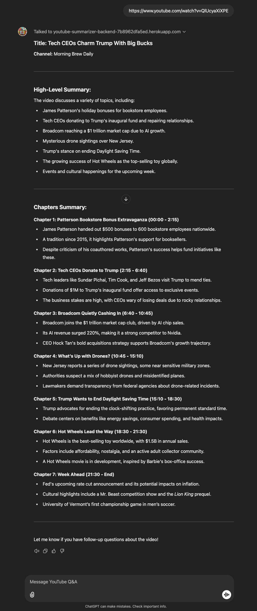
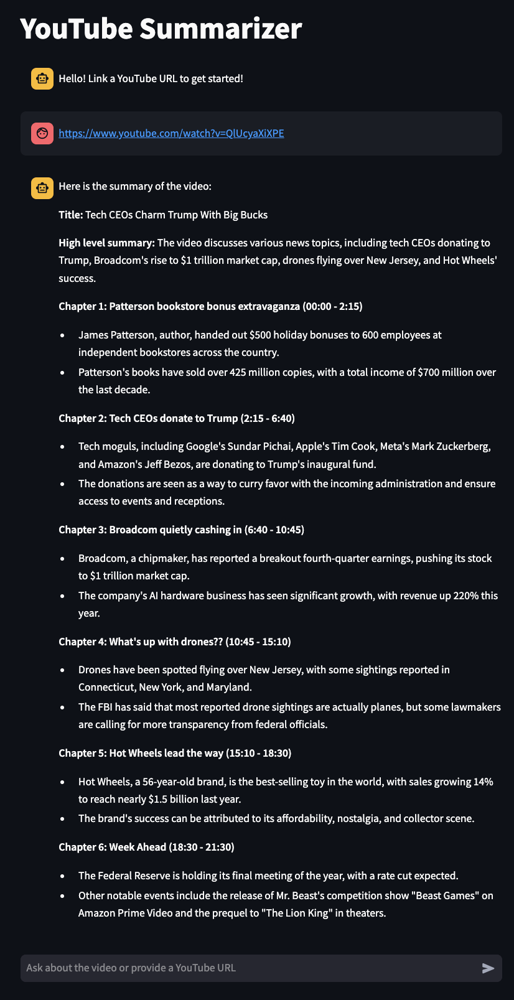

# YouTube Video Summarizer + Q&A

A YouTube video summary tool with two interfaces:
- [Streamlit App](https://my-youtube-summarizer.streamlit.app/): Interactive web interface that summarizes and provides Q&A with LLaMA 3.2 via Replicate API
- [YouTube Q&A GPT](https://chatgpt.com/g/g-677692651cd88191bd497d068d804dc0-youtube-q-a): ChatGPT interface using GPT-4

Both interfaces share the same FastAPI backend hosted on Heroku for video transcript processing and data logic.

Sample video from one of my favourite podcasts: MorningBrewDaily

[](https://www.youtube.com/watch?v=QlUcyaXiXPE)

Demo:


Comparison:
Custom GPT (GPT-4o)            |  Streamlit App (Llama 3.2 7B)
:-------------------------:|:-------------------------:
  |  

## Features

- **Video Summarization**: Generate concise summaries of YouTube videos
- **Interactive Q&A**: Simple RAG architecture used to answer questions about video content
- **Dual Interfaces**: 
  - Streamlit web app powered by LLaMA 3.2 for summarization and Q&A
  - CustomGPT powered by GPT-4 for conversational interaction
- **Unified Backend**: Shared FastAPI backend handles video data retrieval for both interfaces

## Architecture

### Backend (FastAPI)
- Fetches YouTube video metadata and transcripts
- Processes and chunks video content
- Exposes endpoints for both Streamlit and CustomGPT interfaces
- Calls LLaMA 3.2 via Replicate API
- Implements RAG (Retrieval Augmented Generation) with FAISS vector matching
- Manages user sessions and conversation history

### Frontend Options

#### Streamlit Web App
- Displays video summaries and Q&A responses

#### CustomGPT Interface
- Uses ChatGPT 4o
- Uses OpenAPI specification (`openai_api.yaml`) to interact with backend

## Project Structure

```
youtube_summarizer/
├── api/
│   ├── app.py              # FastAPI backend
│   ├── openai_api.yaml     # OpenAPI spec for CustomGPT
│   └── replicate_api.py    # LLaMA API
├── data/
│   ├── get_youtube_data.py # YouTube data fetching
│   └── preprocess.py       # Data preprocessing
├── ui/
│   └── streamlit_qa.py     # Streamlit frontend
├── src/
│   ├── vectorstore.py      # FAISS vector store for RAG
│   └── chat.py             # Chat functionality
├── requirements.txt
├── docker-compose.yml
└── Dockerfile
```

## Prerequisites

- Python 3.10+
- YouTube Data API key
- Replicate API token
- Heroku account for deployment (if deploying with Heroku)


## Environment Variables

- `YOUTUBE_API_KEY`: Required for fetching video metadata
- `REPLICATE_API_TOKEN`: Required for LLaMA model access
- `BACKEND_URL`: Optional, links to deployed backend server
- `PORT`: Optional, defaults to 5001 for the backend server

## Setup

1. Clone the repository:
```bash
git clone <repository-url>
cd youtube_summarizer
```

2. Create and activate a virtual environment:
```bash
python -m venv venv
source venv/bin/activate  # On Windows: venv\Scripts\activate
```

3. Install dependencies:
```bash
pip install -r requirements.txt
```

4. Create a `.env` file in the root directory with your API keys:
```
YOUTUBE_API_KEY=your_youtube_api_key
REPLICATE_API_TOKEN=your_replicate_api_token
```

## Deployment

### Backend Deployment (Heroku)

1. Install the [Heroku CLI](https://devcenter.heroku.com/articles/heroku-cli) and login:
```bash
heroku login
```

2. Create a new Heroku app:
```bash
heroku create your-app-name
```

3. Set the environment variables in Heroku:
```bash
heroku config:set YOUTUBE_API_KEY=your_youtube_api_key
heroku config:set REPLICATE_API_TOKEN=your_replicate_api_token
```

4. Deploy to Heroku:
```bash
git push heroku main
```

The backend API will be available at `https://your-app-name.herokuapp.com`

### Frontend Deployment (Streamlit Cloud)

1. Push your code to a GitHub repository

2. Go to [Streamlit Cloud](https://streamlit.io/cloud)

3. Click "New app" and select your repository

4. Set the following:
   - Main file path: `ui/streamlit_qa.py`
   - Python version: 3.10
   - Add the following secrets in the Streamlit Cloud dashboard:
     - BACKEND_URL: Your Heroku backend URL (e.g., https://your-app-name.herokuapp.com)

The frontend will be available at your Streamlit Cloud URL.

## Local Development

### Running Locally

1. Start the FastAPI backend:
```bash
python api/app.py
```
The backend will be available at `http://localhost:5001`

2. In a new terminal, start the Streamlit frontend:
```bash
streamlit run ui/streamlit_qa.py
```
The UI will be available at `http://localhost:8501`

### Local Docker Deployment
The project includes Docker support for deploying the backend service locally:

```bash
docker-compose up
```
This will start the FastAPI backend service at http://localhost:5001
